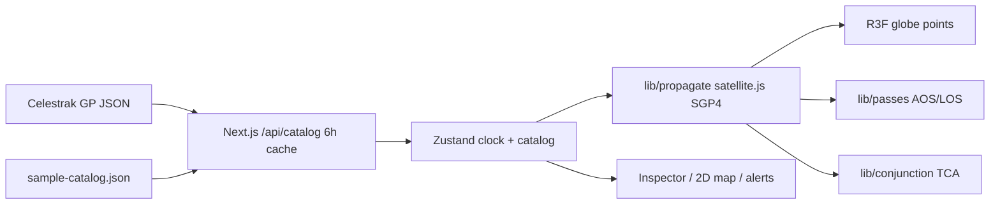

# HELIOS — Orbital Intelligence

Browser mission-control for Earth orbit. Live Celestrak groups, **SGP4/TEME** in `satellite.js`, a WebGL globe, observer passes, and a honest conjunction screen.

## Run

```bash
cd helios-orbital
npm install
npm run dev
```

Open [http://localhost:3000](http://localhost:3000) — ISS: [http://localhost:3000/?norad=25544](http://localhost:3000/?norad=25544)

```bash
npm run build
npm test
```

`⌘K` / `Ctrl+K` command palette. `?` keyboard. Offline: Celestrak miss → `public/data/sample-catalog.json`.

## Architecture



| Layer | Path |
|---|---|
| Physics | `lib/propagate.ts` `lib/tle.ts` `lib/coords.ts` `lib/passes.ts` `lib/conjunction.ts` |
| State | `lib/store.ts` — watchlist `helios-watchlist`, observer `helios-observer`, settings `helios-settings` |
| APIs | `app/api/catalog` `app/api/passes` `app/api/conjunctions` |
| Globe | `components/helios/*` |
| Features | `components/features/*` |

## Features

- Command palette (`⌘K`) — sats, groups, rate, labels / track / terminator, Go to ISS
- Pass predictor — observer AOS / LOS / max el; click row → select + clock to AOS
- Conjunction board — TCA, miss km, rel vel; **<5 km crit**, **<20 km amber**
- Compare — range km, altitude Δ, geocenter angular sep
- 2D equirectangular map + selected ground track
- Alerts — ISS pass < 2h; miss < 10 km
- Settings — maxRender, labels, ground track, terminator, reduced motion (persisted)
- Export — selected sat ephemeris CSV, next 90 min
- Keyboard overlay `?`
- Methodology drawer — what SGP4 actually is
- Presets — ISS, Starlink, GPS, GEO belt
- URL `?norad=&lat=&lon=&t=` hydrates selection, observer, and sim epoch

## Algorithms (short)

**SGP4 / TEME.** A TLE is mean elements, not a Cartesian state. We wrap `satellite.js`; we do not numerically integrate, and we do not apply polar motion. Positions are TEME-ish ECI, then geodetic via `eciToGeodetic`.

**Passes.** Elevation vs observer, 10° mask, 30 s coarse grid, binary refine on AOS/LOS. Max el is the coarse peak. Good enough for a console, not a dish scheduler.

**Conjunctions.** Pairwise TEME range, min over a stepped window. No covariance, no CDM, no Pc. Color is geometry.

**Catalog.** `gp.php?GROUP=&FORMAT=json`, ~6 h cache. Fetch fail → sample file so the demo never dies.

## Interview talking points

- Why SGP4 and not two-body: drag, J2-ish mean motion, operational TLEs are published for SGP4.
- TEME vs ECEF: GMST rotation is the cheap step; polar motion is the thing we skip and should name.
- Pass predictor: why a 30 s grid plus refine instead of an analytic horizon crossing.
- Conjunction screen: miss distance is not probability. <5 km is a triage color, not a conjunction data message.
- Rendering 800 sats: points / instancing, not 800 meshes; selected object on a faster loop.
- Offline path: an interviewer will pull ethernet. Sample catalog is the answer.
- What you would not ship to a SSA ops floor: this covariance-free pair scan.

## Keyboard

| Key | Action |
|---|---|
| `⌘K` / `Ctrl+K` | Palette |
| `?` | Cheatsheet |
| Space | Play / pause |
| `[` `]` | Rate |
| `/` | Catalog search |
| `H` | Home / reset camera |
| `F` | Fullscreen |
| `P` | Pass predictor |
| `C` | Conjunctions |
| `M` | 2D map |
| `G` | Go to ISS |
| Esc | Close overlay / clear select |

Space is ignored while the catalog search (or any input) is focused.

## What’s new (phase 4)

- Self-hosted IBM Plex Sans + Mono (`@fontsource`) — no Google Fonts round-trip.
- Observer city presets (Houston default, plus Boston, London, Tokyo, Sydney, Dubai, New Delhi, San Francisco). Pass window 48–72h. Empty state: “No pass in window — try another observer or widen hours.”
- Home camera (`H`) + min-distance clamp so ISS deep-zoom cannot collapse Earth into a blank disc.
- Inspector: STALE TLE (>7d vs sim clock), look angles from `elevationAzimuth`, ECLIPSED umbra/penumbra, DECAY RISK (perigee < 250 km), Keplerian panel, 72h pass calendar, mission card, slant range + range-rate HUD.
- Real terminator: night side darkens, sun disc, terminator ring, directional light tracks the subsolar vector. Toggle is not cosmetic.
- 5° coverage footprint on globe + 2D map. Object-type point colors (payload / R/B / debris) with catalog legend + orbit-class histogram.
- Share URL `?norad=&lat=&lon=&t=` (copy from dock). Fullscreen (`F`). Screenshot PNG `helios-{norad}-{timestamp}.png`.
- Conjunctions still drop <1 km pairs; ISS/CSS same-stack modules are also hidden.

